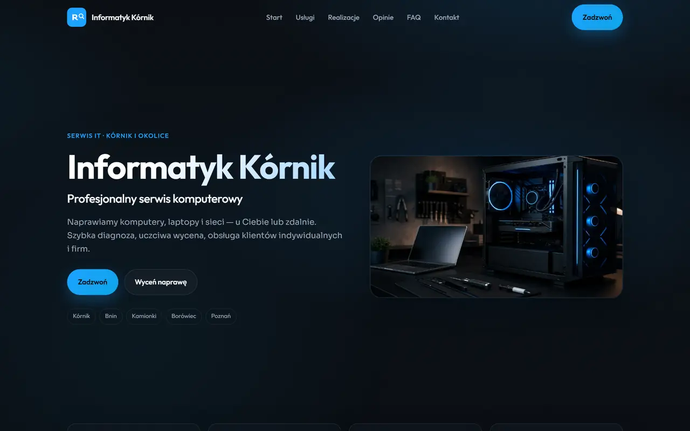
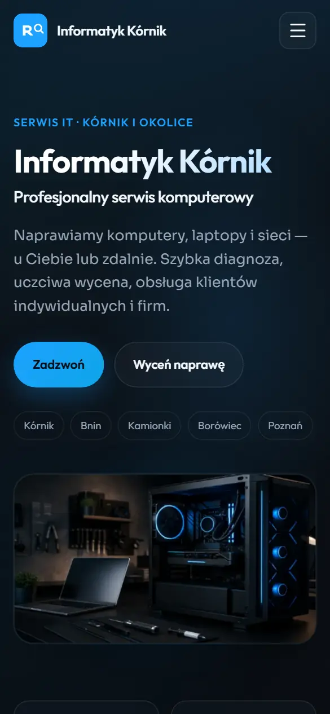
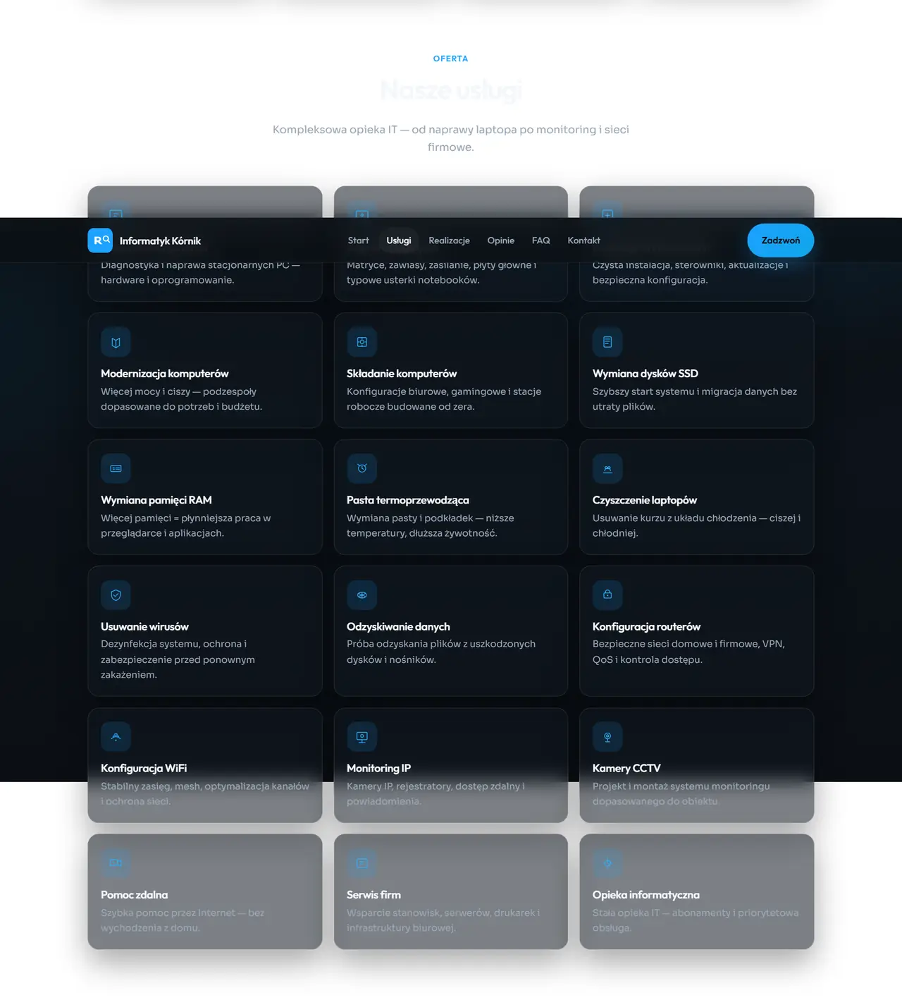
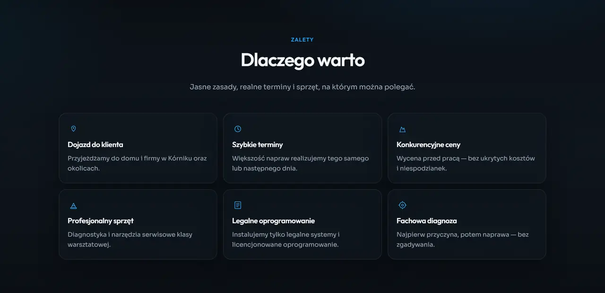
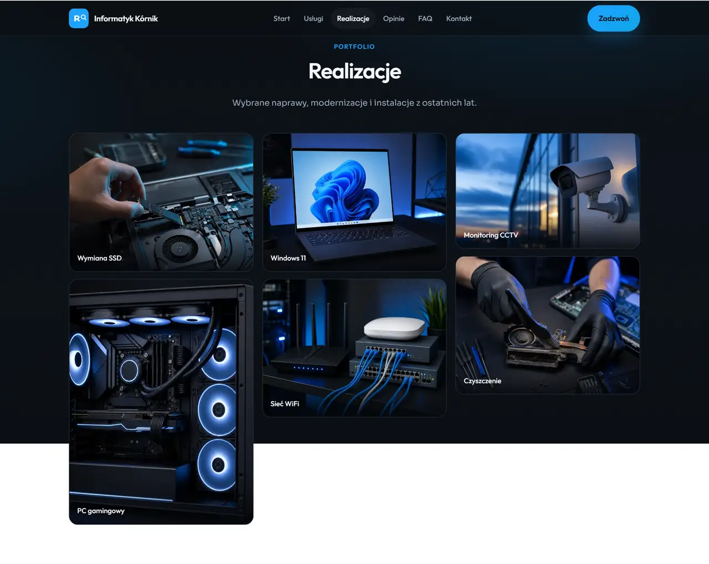
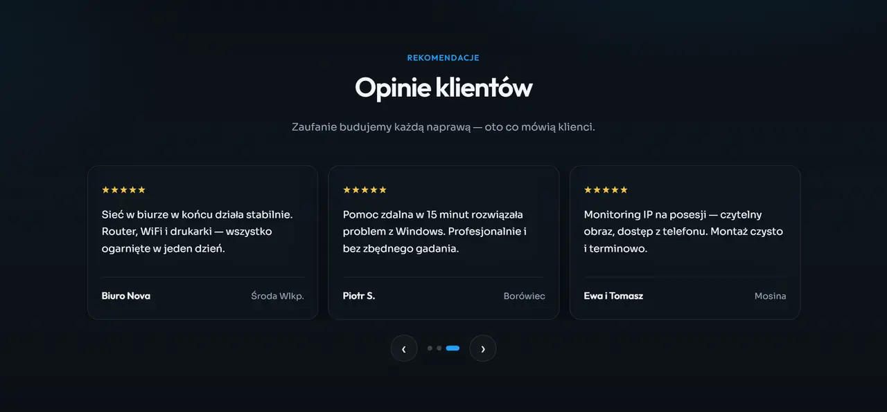
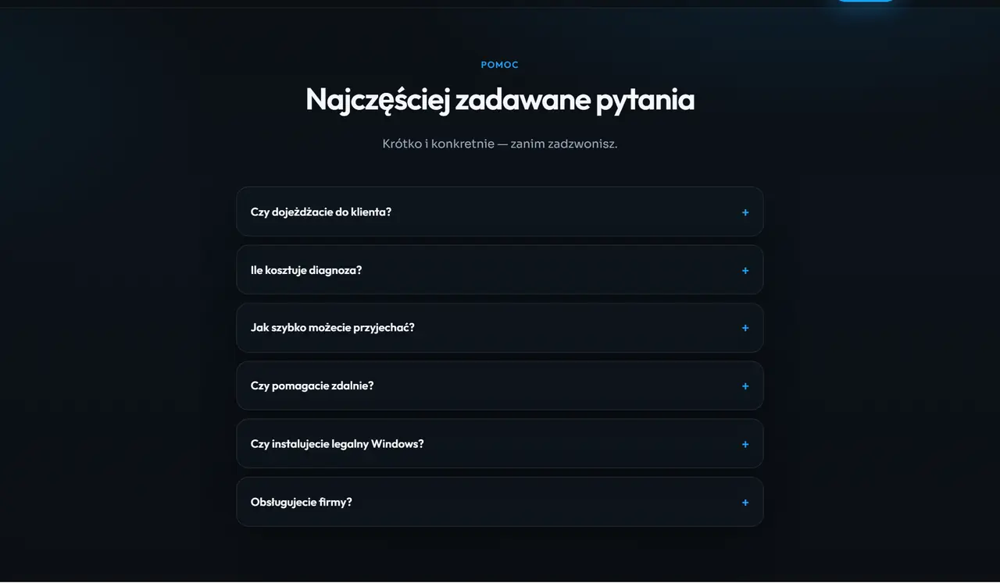
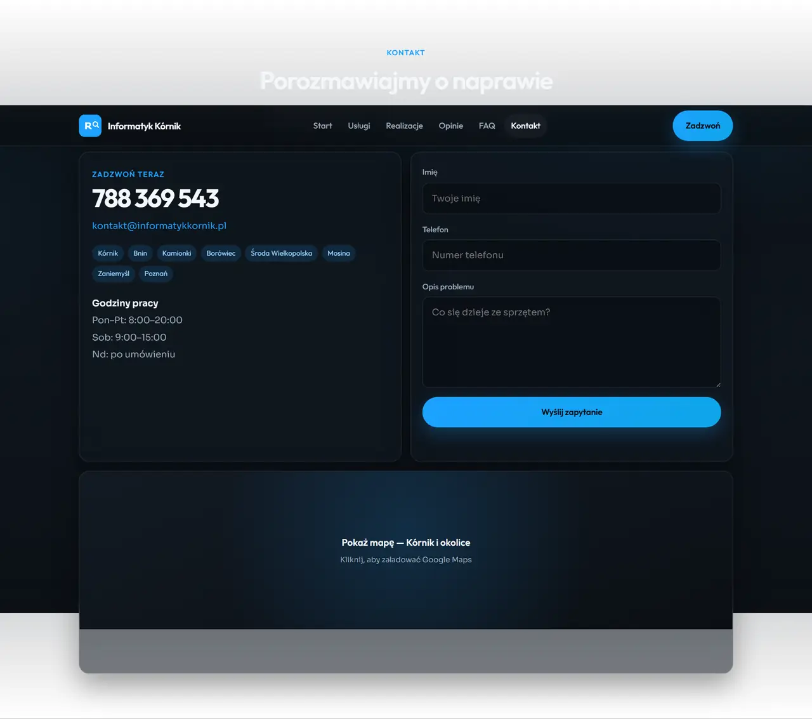
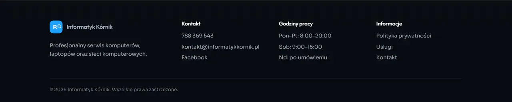
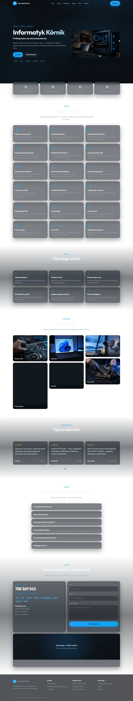

# Informatyk Kórnik

Profesjonalna, statyczna strona WWW dla serwisu komputerowego **Informatyk Kórnik** — ciemny motyw premium, HTML5 / CSS3 / Vanilla JS, gotowa pod Nginx.

**Podgląd lokalny:** `python -m http.server 8765` → [http://127.0.0.1:8765](http://127.0.0.1:8765)

---

## Podgląd sekcji

### Navbar (sticky)


### Hero



### Widok mobilny (Hero)



### Liczniki


### Nasze usługi



### Dlaczego warto



### Realizacje



### Opinie



### FAQ



### Kontakt



### Stopka



### Cała strona



---

## Stack

- HTML5, CSS3, JavaScript (Vanilla)
- Mobile First, responsywna
- Bez WordPressa, Bootstrapa i frameworków
- Lokalne fonty (Outfit, Sora) + obrazy WebP
- SEO: meta, Open Graph, Twitter Cards, Schema.org, `robots.txt`, `sitemap.xml`

## Struktura

```
├── index.html
├── style.css / style.src.css
├── script.js / script.src.js
├── polityka-prywatnosci.html
├── robots.txt
├── sitemap.xml
├── site.webmanifest
├── favicon.svg / favicon.png
├── nginx.conf.example
├── fonts/
├── icons/
├── images/
└── screenshots/
```

## Uruchomienie lokalne

```bash
cd "Informatyk kornik Page"
python -m http.server 8765
```

Otwórz: http://127.0.0.1:8765/

## Wdrożenie (Nginx)

1. Skopiuj pliki na serwer (np. `/var/www/informatykkornik`).
2. Skorzystaj z `nginx.conf.example` (dostosuj `server_name` i certyfikaty SSL).
3. Przed publikacją podmień:
   - domenę w meta / canonical / sitemap
   - e-mail i link Facebook

## Kontakt firmy

- **Telefon:** 788 369 543  
- **Obszar:** Kórnik, Bnin, Kamionki, Borówiec, Środa Wielkopolska, Mosina, Zaniemyśl, Poznań
